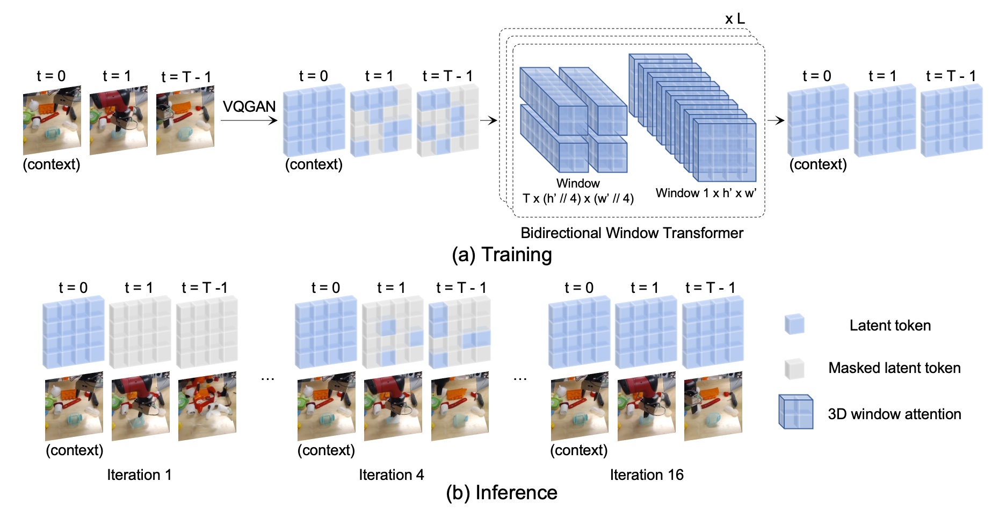
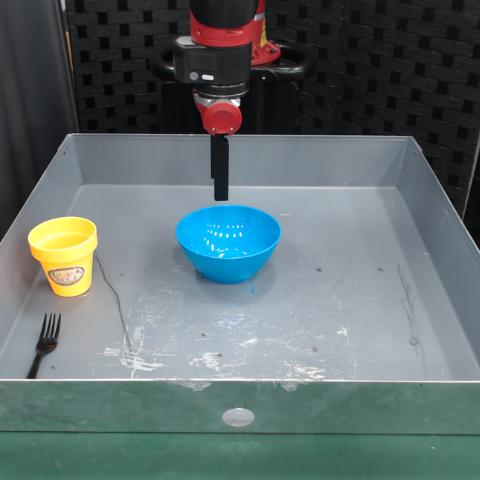
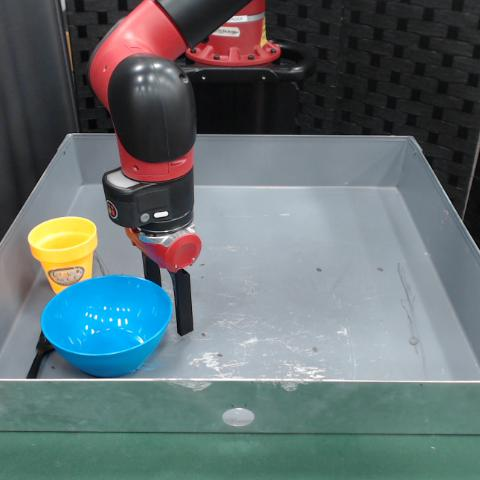

	<video class="results_video_64" playsinline autoplay muted loop>
		  <source src="resources/teaser.mp4" type='video/mp4'>
		  Your browser does not support the video tag.
	</video>

## Abstract

The ability to predict future visual observations conditioned on past observations and motor commands can enable embodied agents to plan solutions to a variety of tasks in complex environments. This work shows that we can create good video prediction models by pre-training transformers via masked visual modeling. Our approach, named MaskViT, is based on two simple design decisions. First, for memory and training efficiency, we use two types of window attention: spatial and spatiotemporal. Second, during training, we mask a *variable* percentage of tokens instead of a *fixed* mask ratio. For inference, MaskViT generates all tokens via iterative refinement where we incrementally decrease the masking ratio following a mask scheduling function. On several datasets we demonstrate that MaskViT outperforms prior works in video prediction, is parameter efficient, and can generate high-resolution videos ($$256\times256$$). Further, we demonstrate the benefits of inference speedup (up to $$512\times$$) due to iterative decoding by using MaskViT for planning on a real robot. Our work suggests that we can endow embodied agents with powerful predictive models by leveraging the general framework of masked visual modeling with minimal domain knowledge. 

---

## Qualitative results
Here we present additional qualitative videos of results from MaskViT. Ground truth videos are on the left of each pair while predicted videos are on the right. A red border indicates that the frame is a (VQ-GAN reconstructed) context frame, and a green border indicates a predicted frame.

### BAIR (64x64, action-free)

	<video class="results_video_64" playsinline autoplay muted loop>
		  <source src="resources/bair/bair_indiv_0.mp4" type='video/mp4'>
		  <source src="resources/bair/bair_indiv_0_sfri.mp4" type='video/mp4'>
		  <source src="resources/bair/bair_indiv_0.webm" type='video/webm'>
		  Your browser does not support the video tag.
	</video>	
	<video class="results_video_64" playsinline autoplay muted loop>
		  <source src="resources/bair/bair_indiv_1.mp4" type='video/mp4'>
		  <source src="resources/bair/bair_indiv_1_sfri.mp4" type='video/mp4'>
		  <source src="resources/bair/bair_indiv_1.webm" type='video/webm'>
		  Your browser does not support the video tag.
	</video>	
	<video class="results_video_64" playsinline autoplay muted loop>
		  <source src="resources/bair/bair_indiv_2.mp4" type='video/mp4'>
		  <source src="resources/bair/bair_indiv_2_sfri.mp4" type='video/mp4'>
		  <source src="resources/bair/bair_indiv_2.webm" type='video/webm'>
		  Your browser does not support the video tag.
	</video>	
	<video class="results_video_64" playsinline autoplay muted loop>
		  <source src="resources/bair/bair_indiv_3.mp4" type='video/mp4'>
		  <source src="resources/bair/bair_indiv_3_sfri.mp4" type='video/mp4'>
		  <source src="resources/bair/bair_indiv_3.webm" type='video/webm'>
		  Your browser does not support the video tag.
	</video>	
	<video class="results_video_64" playsinline autoplay muted loop>
		  <source src="resources/bair/bair_indiv_4.mp4" type='video/mp4'>
		  <source src="resources/bair/bair_indiv_4_sfri.mp4" type='video/mp4'>
		  <source src="resources/bair/bair_indiv_4.webm" type='video/webm'>
		  Your browser does not support the video tag.
	</video>	
	<video class="results_video_64" playsinline autoplay muted loop>
		  <source src="resources/bair/bair_indiv_5.mp4" type='video/mp4'>
		  <source src="resources/bair/bair_indiv_5_sfri.mp4" type='video/mp4'>
		  <source src="resources/bair/bair_indiv_5.webm" type='video/webm'>
		  Your browser does not support the video tag.
	</video>	
	<video class="results_video_64" playsinline autoplay muted loop>
		  <source src="resources/bair/bair_indiv_6.mp4" type='video/mp4'>
		  <source src="resources/bair/bair_indiv_6_sfri.mp4" type='video/mp4'>
		  <source src="resources/bair/bair_indiv_6.webm" type='video/webm'>
		  Your browser does not support the video tag.
	</video>	
	<video class="results_video_64" playsinline autoplay muted loop>
		  <source src="resources/bair/bair_indiv_7.mp4" type='video/mp4'>
		  <source src="resources/bair/bair_indiv_7_sfri.mp4" type='video/mp4'>
		  <source src="resources/bair/bair_indiv_7.webm" type='video/webm'>
		  Your browser does not support the video tag.
	</video>	
	<video class="results_video_64" playsinline autoplay muted loop>
		  <source src="resources/bair/bair_indiv_8.mp4" type='video/mp4'>
		  <source src="resources/bair/bair_indiv_8_sfri.mp4" type='video/mp4'>
		  <source src="resources/bair/bair_indiv_8.webm" type='video/webm'>
		  Your browser does not support the video tag.
	</video>	
	<video class="results_video_64" playsinline autoplay muted loop>
		  <source src="resources/bair/bair_indiv_9.mp4" type='video/mp4'>
		  <source src="resources/bair/bair_indiv_9_sfri.mp4" type='video/mp4'>
		  <source src="resources/bair/bair_indiv_9.webm" type='video/webm'>
		  Your browser does not support the video tag.
	</video>	
	<video class="results_video_64" playsinline autoplay muted loop>
		  <source src="resources/bair/bair_indiv_10.mp4" type='video/mp4'>
		  <source src="resources/bair/bair_indiv_10_sfri.mp4" type='video/mp4'>
		  <source src="resources/bair/bair_indiv_10.webm" type='video/webm'>
		  Your browser does not support the video tag.
	</video>	
	<video class="results_video_64" playsinline autoplay muted loop>
		  <source src="resources/bair/bair_indiv_11.mp4" type='video/mp4'>
		  <source src="resources/bair/bair_indiv_11_sfri.mp4" type='video/mp4'>
		  <source src="resources/bair/bair_indiv_11.webm" type='video/webm'>
		  Your browser does not support the video tag.
	</video>	

	

---
### KITTI (256x256)

	
 
		<video class="results_video_256" playsinline autoplay muted loop>
			  <source src="resources/kitti/kitti_indiv_0.mp4" type='video/mp4'>
			  <source src="resources/kitti/kitti_indiv_0_sfri.mp4" type='video/mp4'>
			  <source src="resources/kitti/kitti_indiv_0.webm" type='video/webm'>
			  Your browser does not support the video tag.
		</video>	
		<video class="results_video_256" playsinline autoplay muted loop>
			  <source src="resources/kitti/kitti_indiv_1.mp4" type='video/mp4'>
			  <source src="resources/kitti/kitti_indiv_1_sfri.mp4" type='video/mp4'>
			  <source src="resources/kitti/kitti_indiv_1.webm" type='video/webm'>
			  Your browser does not support the video tag.
		</video>	
	

	<video class="results_video_256" playsinline autoplay muted loop>
		  <source src="resources/kitti/kitti_indiv_2.mp4" type='video/mp4'>
		  <source src="resources/kitti/kitti_indiv_2_sfri.mp4" type='video/mp4'>
		  <source src="resources/kitti/kitti_indiv_2.webm" type='video/webm'>
		  Your browser does not support the video tag.
	</video>	
	<video class="results_video_256" playsinline autoplay muted loop>
		  <source src="resources/kitti/kitti_indiv_3.mp4" type='video/mp4'>
		  <source src="resources/kitti/kitti_indiv_3_sfri.mp4" type='video/mp4'>
		  <source src="resources/kitti/kitti_indiv_3.webm" type='video/webm'>
		  Your browser does not support the video tag.
	</video>	
	<video class="results_video_256" playsinline autoplay muted loop>
		  <source src="resources/kitti/kitti_indiv_4.mp4" type='video/mp4'>
		  <source src="resources/kitti/kitti_indiv_4_sfri.mp4" type='video/mp4'>
		  <source src="resources/kitti/kitti_indiv_4.webm" type='video/webm'>
		  Your browser does not support the video tag.
	</video>	
	<video class="results_video_256" playsinline autoplay muted loop>
		  <source src="resources/kitti/kitti_indiv_5.mp4" type='video/mp4'>
		  <source src="resources/kitti/kitti_indiv_5_sfri.mp4" type='video/mp4'>
		  <source src="resources/kitti/kitti_indiv_5.webm" type='video/webm'>
		  Your browser does not support the video tag.
	</video>	
	<video class="results_video_256" playsinline autoplay muted loop>
		  <source src="resources/kitti/kitti_indiv_6.mp4" type='video/mp4'>
		  <source src="resources/kitti/kitti_indiv_6_sfri.mp4" type='video/mp4'>
		  <source src="resources/kitti/kitti_indiv_6.webm" type='video/webm'>
		  Your browser does not support the video tag.
	</video>	
	<video class="results_video_256" playsinline autoplay muted loop>
		  <source src="resources/kitti/kitti_indiv_7.mp4" type='video/mp4'>
		  <source src="resources/kitti/kitti_indiv_7_sfri.mp4" type='video/mp4'>
		  <source src="resources/kitti/kitti_indiv_7.webm" type='video/webm'>
		  Your browser does not support the video tag.
	</video>	
	<video class="results_video_256" playsinline autoplay muted loop>
		  <source src="resources/kitti/kitti_indiv_8.mp4" type='video/mp4'>
		  <source src="resources/kitti/kitti_indiv_8_sfri.mp4" type='video/mp4'>
		  <source src="resources/kitti/kitti_indiv_8.webm" type='video/webm'>
		  Your browser does not support the video tag.
	</video>	
	<video class="results_video_256" playsinline autoplay muted loop>
		  <source src="resources/kitti/kitti_indiv_9.mp4" type='video/mp4'>
		  <source src="resources/kitti/kitti_indiv_9_sfri.mp4" type='video/mp4'>
		  <source src="resources/kitti/kitti_indiv_9.webm" type='video/webm'>
		  Your browser does not support the video tag.
	</video>	
	<video class="results_video_256" playsinline autoplay muted loop>
		  <source src="resources/kitti/kitti_indiv_10.mp4" type='video/mp4'>
		  <source src="resources/kitti/kitti_indiv_10_sfri.mp4" type='video/mp4'>
		  <source src="resources/kitti/kitti_indiv_10.webm" type='video/webm'>
		  Your browser does not support the video tag.
	</video>	
	<video class="results_video_256" playsinline autoplay muted loop>
		  <source src="resources/kitti/kitti_indiv_11.mp4" type='video/mp4'>
		  <source src="resources/kitti/kitti_indiv_11_sfri.mp4" type='video/mp4'>
		  <source src="resources/kitti/kitti_indiv_11.webm" type='video/webm'>
		  Your browser does not support the video tag.
	</video>	

---
### RoboNet (256x256)

	<video class="results_video_256" playsinline autoplay muted loop>
		  <source src="resources/robonet/robonet_indiv_0.mp4" type='video/mp4'>
		  <source src="resources/robonet/robonet_indiv_0_sfri.mp4" type='video/mp4'>
		  <source src="resources/robonet/robonet_indiv_0.webm" type='video/webm'>
		  Your browser does not support the video tag.
	</video>	
	<video class="results_video_256" playsinline autoplay muted loop>
		  <source src="resources/robonet/robonet_indiv_1.mp4" type='video/mp4'>
		  <source src="resources/robonet/robonet_indiv_1_sfri.mp4" type='video/mp4'>
		  <source src="resources/robonet/robonet_indiv_1.webm" type='video/webm'>
		  Your browser does not support the video tag.
	</video>	
	<video class="results_video_256" playsinline autoplay muted loop>
		  <source src="resources/robonet/robonet_indiv_2.mp4" type='video/mp4'>
		  <source src="resources/robonet/robonet_indiv_2_sfri.mp4" type='video/mp4'>
		  <source src="resources/robonet/robonet_indiv_2.webm" type='video/webm'>
		  Your browser does not support the video tag.
	</video>	
	<video class="results_video_256" playsinline autoplay muted loop>
		  <source src="resources/robonet/robonet_indiv_3.mp4" type='video/mp4'>
		  <source src="resources/robonet/robonet_indiv_3_sfri.mp4" type='video/mp4'>
		  <source src="resources/robonet/robonet_indiv_3.webm" type='video/webm'>
		  Your browser does not support the video tag.
	</video>	
	<video class="results_video_256" playsinline autoplay muted loop>
		  <source src="resources/robonet/robonet_indiv_4.mp4" type='video/mp4'>
		  <source src="resources/robonet/robonet_indiv_4_sfri.mp4" type='video/mp4'>
		  <source src="resources/robonet/robonet_indiv_4.webm" type='video/webm'>
		  Your browser does not support the video tag.
	</video>	
	<video class="results_video_256" playsinline autoplay muted loop>
		  <source src="resources/robonet/robonet_indiv_5.mp4" type='video/mp4'>
		  <source src="resources/robonet/robonet_indiv_5_sfri.mp4" type='video/mp4'>
		  <source src="resources/robonet/robonet_indiv_5.webm" type='video/webm'>
		  Your browser does not support the video tag.
	</video>	
	<video class="results_video_256" playsinline autoplay muted loop>
		  <source src="resources/robonet/robonet_indiv_6.mp4" type='video/mp4'>
		  <source src="resources/robonet/robonet_indiv_6_sfri.mp4" type='video/mp4'>
		  <source src="resources/robonet/robonet_indiv_6.webm" type='video/webm'>
		  Your browser does not support the video tag.
	</video>	
	<video class="results_video_256" playsinline autoplay muted loop>
		  <source src="resources/robonet/robonet_indiv_7.mp4" type='video/mp4'>
		  <source src="resources/robonet/robonet_indiv_7_sfri.mp4" type='video/mp4'>
		  <source src="resources/robonet/robonet_indiv_7.webm" type='video/webm'>
		  Your browser does not support the video tag.
	</video>	
	<video class="results_video_256" playsinline autoplay muted loop>
		  <source src="resources/robonet/robonet_indiv_8.mp4" type='video/mp4'>
		  <source src="resources/robonet/robonet_indiv_8_sfri.mp4" type='video/mp4'>
		  <source src="resources/robonet/robonet_indiv_8.webm" type='video/webm'>
		  Your browser does not support the video tag.
	</video>	
	<video class="results_video_256" playsinline autoplay muted loop>
		  <source src="resources/robonet/robonet_indiv_9.mp4" type='video/mp4'>
		  <source src="resources/robonet/robonet_indiv_9_sfri.mp4" type='video/mp4'>
		  <source src="resources/robonet/robonet_indiv_9.webm" type='video/webm'>
		  Your browser does not support the video tag.
	</video>	
	<video class="results_video_256" playsinline autoplay muted loop>
		  <source src="resources/robonet/robonet_indiv_10.mp4" type='video/mp4'>
		  <source src="resources/robonet/robonet_indiv_10_sfri.mp4" type='video/mp4'>
		  <source src="resources/robonet/robonet_indiv_10.webm" type='video/webm'>
		  Your browser does not support the video tag.
	</video>	
	<video class="results_video_256" playsinline autoplay muted loop>
		  <source src="resources/robonet/robonet_indiv_11.mp4" type='video/mp4'>
		  <source src="resources/robonet/robonet_indiv_11_sfri.mp4" type='video/mp4'>
		  <source src="resources/robonet/robonet_indiv_11.webm" type='video/webm'>
		  Your browser does not support the video tag.
	</video>	

--- 

## Real robot experiments 

We demonstrate how the performance improvements afforded by MaskViT allow it to be leveraged for control through visual planning. We show examples of predicted plans and overall trajectories executed on a Sawyer robot by planning using MaskViT as an action-conditioned forward dynamics model.

 

	<figure style="display: inline-block">
		
		<figcaption align = "center"><b>Initial observation</b></figcaption>
	</figure>
	<figure style="display: inline-block">
		
		<figcaption align = "center"><b>Goal observation</b></figcaption>
	</figure>
	<figure style="display: inline-block">
		<video class="results_video_control" playsinline autoplay muted loop onloadstart="this.playbackRate = 1.5;">
			  <source src="resources/robot/bowl_clip.mp4" type='video/mp4'>
			  Your browser does not support the video tag.
		</video>	
		<figcaption align = "center"><b> Full execution (sped up) </b></figcaption>
	</figure>

	<figure style="display: inline-block; width: 65%">
		<video class="results_video_plan" playsinline autoplay muted loop>
			  <source src="resources/robot/bowl_plan.mp4" type='video/mp4'>
			  Your browser does not support the video tag.
		</video>	
		<figcaption align = "center"><b>Visualized predictions for best plans at time step 4.</b></figcaption>
	</figure>

	<figure style="display: inline-block">
		
		<figcaption align = "center"><b>Initial observation</b></figcaption>
	</figure>
	<figure style="display: inline-block">
		
		<figcaption align = "center"><b>Goal observation</b></figcaption>
	</figure>
	<figure style="display: inline-block">
		<video class="results_video_control" playsinline autoplay muted loop onloadstart="this.playbackRate = 1.5;">
			  <source src="resources/robot/hat_clip.mp4" type='video/mp4'>
			  Your browser does not support the video tag.
		</video>	
		<figcaption align = "center"><b> Full execution (sped up) </b></figcaption>
	</figure>

	<figure style="display: inline-block; width: 65%">
		<video class="results_video_plan" playsinline autoplay muted loop>
			  <source src="resources/robot/hat_plan.mp4" type='video/mp4'>
			  Your browser does not support the video tag.
		</video>	
		<figcaption align = "center"><b>Visualized predictions for best plans at time step 7.</b></figcaption>
	</figure>

